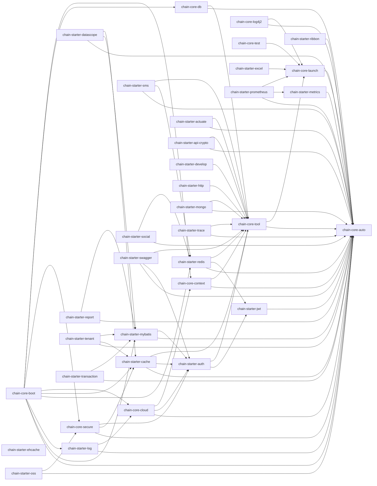

# 框架概述与分析

模块依赖图

```mermaid
graph LR
chain-core-auto
chain-core-boot-->chain-core-context
chain-core-boot-->chain-core-db
chain-core-boot-->chain-core-secure
chain-core-boot-->chain-core-cloud
chain-core-boot-->chain-starter-cache
chain-core-boot-->chain-starter-redis
chain-core-boot-->chain-starter-log
chain-core-boot-->chain-starter-mybatis
chain-core-boot-->chain-core-auto
chain-core-cloud-->chain-core-context
chain-core-cloud-->chain-starter-auth
chain-core-cloud-->chain-core-auto
chain-core-context-->chain-core-tool
chain-core-context-->chain-core-auto
chain-core-db-->chain-core-tool
chain-core-db-->chain-core-auto
chain-core-launch-->chain-core-auto
chain-core-log4j2-->chain-core-launch
chain-core-log4j2-->chain-core-auto
chain-core-secure-->chain-starter-auth
chain-core-secure-->chain-starter-cache
chain-core-secure-->chain-core-auto
chain-core-test-->chain-core-launch
chain-core-tool-->chain-core-launch
chain-core-tool-->chain-core-auto
chain-starter-actuate-->chain-core-tool
chain-starter-actuate-->chain-core-auto
chain-starter-api-crypto-->chain-core-tool
chain-starter-api-crypto-->chain-core-auto
chain-starter-auth-->chain-core-tool
chain-starter-auth-->chain-starter-jwt
chain-starter-cache-->chain-core-tool
chain-starter-cache-->chain-starter-auth
chain-starter-cache-->chain-core-auto
chain-starter-datascope-->chain-starter-cache
chain-starter-datascope-->chain-starter-mybatis
chain-starter-datascope-->chain-core-auto
chain-starter-develop-->chain-core-tool
chain-starter-ehcache
chain-starter-excel-->chain-core-launch
chain-starter-http-->chain-core-tool
chain-starter-jwt-->chain-core-auto
chain-starter-log-->chain-core-cloud
chain-starter-log-->chain-core-auto
chain-starter-metrics-->chain-core-auto
chain-starter-mongo-->chain-core-tool
chain-starter-mongo-->chain-core-auto
chain-starter-mybatis-->chain-starter-auth
chain-starter-mybatis-->chain-core-auto
chain-starter-oss-->chain-core-secure
chain-starter-oss-->chain-core-auto
chain-starter-prometheus-->chain-core-launch
chain-starter-prometheus-->chain-starter-metrics
chain-starter-prometheus-->chain-core-auto
chain-starter-redis-->chain-core-tool
chain-starter-redis-->chain-starter-jwt
chain-starter-redis-->chain-core-auto
chain-starter-report-->chain-starter-mybatis
chain-starter-report-->chain-core-auto
chain-starter-ribbon-->chain-core-auto
chain-starter-sms-->chain-core-tool
chain-starter-sms-->chain-starter-redis
chain-starter-sms-->chain-core-auto
chain-starter-social-->chain-starter-redis
chain-starter-social-->chain-core-auto
chain-starter-swagger-->chain-core-tool
chain-starter-swagger-->chain-starter-auth
chain-starter-swagger-->chain-core-auto
chain-starter-tenant-->chain-starter-mybatis
chain-starter-tenant-->chain-starter-cache
chain-starter-tenant-->chain-core-auto
chain-starter-trace-->chain-core-tool
chain-starter-trace-->chain-core-auto
chain-starter-transaction-->chain-starter-mybatis
chain-starter-transaction-->chain-core-auto
```